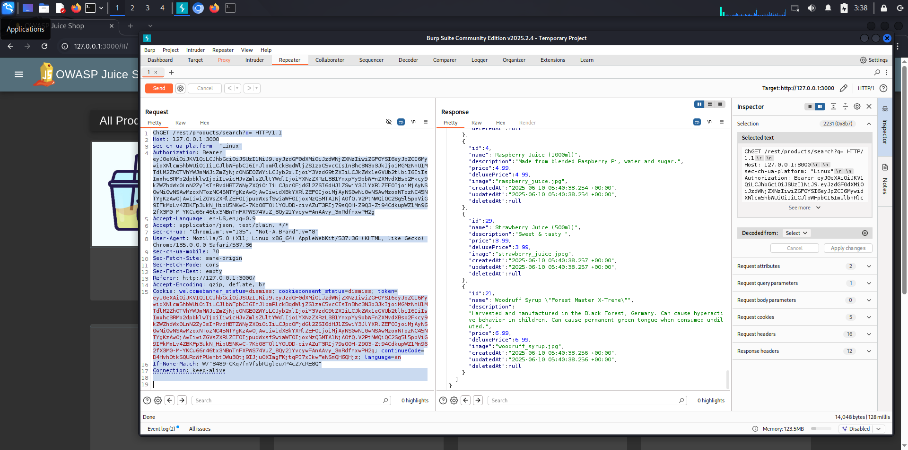
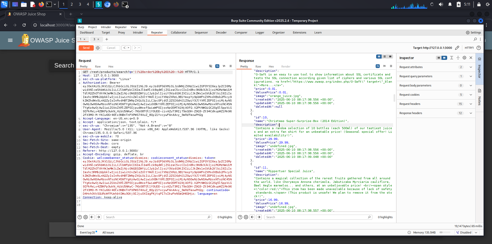
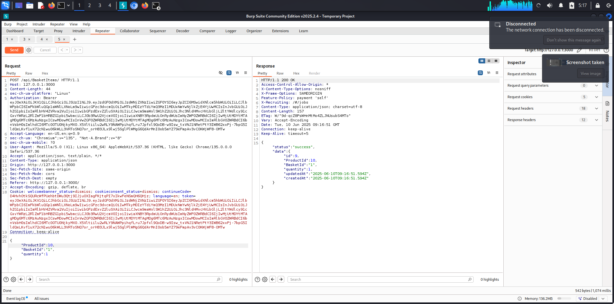
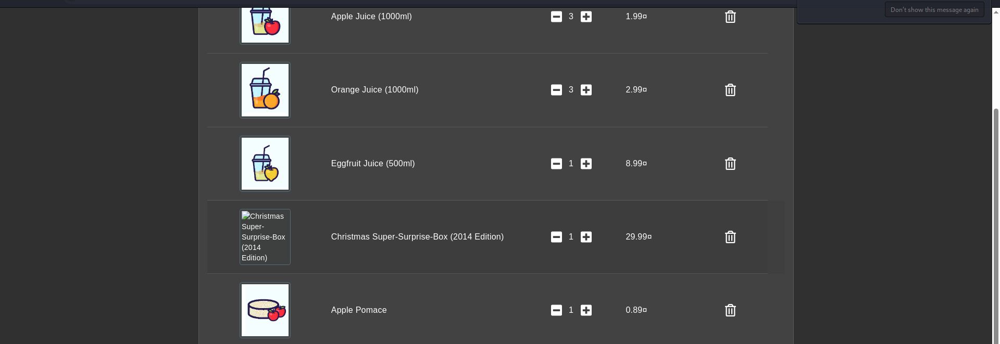
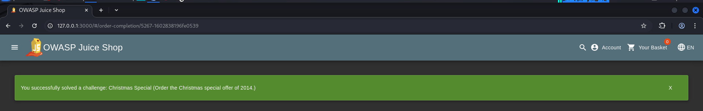

# Challenge: Christmas Special

## Table of Contents

1. [Challenge Description](#challenge-description)
2. [Solution Approach](#solution-approach)  
    * [1. Initial Reconnaissance & Problem Identification](#1-initial-reconnaissance--problem-identification)
    * [2. Intercepting Product Search with Burp Suite](#2-intercepting-product-search-with-burp-suite)
    * [3. SQL Injection to Reveal Hidden Products](#3-sql-injection-to-reveal-hidden-products)
    * [4. Adding the Hidden Product to Basket](#4-adding-the-hidden-product-to-basket)
3. [Challenge Solved!](#challenge-solved)
4. [Video Demonstration](#video-demonstration)

---

## Challenge Description
* **Name:** Christmas Special
* **Description:** Order the Christmas special offer of 2014.
* **Difficulty:** ⭐⭐⭐⭐ (4 Stars)
* **Category:** Injection
* **Tools Used:** Burp Suite

---

## Solution Approach

This challenge leverages a SQL Injection vulnerability in the product search functionality to reveal and then interact with a "deleted" product, allowing it to be added to the shopping basket.

### 1. Initial Reconnaissance & Problem Identification

* **Objective:** Find and order the "Christmas special offer of 2014."
* **Initial Search:** Navigating to the Juice Shop homepage and using the search bar for "Christmas" yields no results. This indicates that the item is either not currently listed or is hidden from standard searches.

### 2. Intercepting Product Search with Burp Suite

Since a direct search failed, the next step is to analyze how the product search works at a lower level.

* **Start Burp Suite:** Configure your browser to proxy through Burp Suite.
* **Navigate to Home Page:** Go to the Juice Shop homepage where the list of products is displayed. This ensures that a `GET /rest/products/search` request is sent.
* **Intercept Request:** In Burp Suite's `Proxy` tab, turn `Intercept is on`.
* **Identify Search Request:**
    When you interact with the search function (even with an empty query), you'll capture a request similar to this:

    ```http
    GET /rest/products/search?q= HTTP/1.1
    Host: 127.0.0.1:3000
    User-Agent: Mozilla/5.0 (X11; Linux x86_64) AppleWebKit/537.36 (KHTML, like Gecko) Chrome/135.0.0.0 Safari/537.36
    Accept: application/json, text/plain, */*
    Referer: [http://127.0.0.1:3000/](http://127.0.0.1:3000/)
    Cookie: welcomebanner_status=dismiss; cookieconsent_status=dismiss; token=...; continueCode=...; language=en
    Connection: keep-alive
    ```

    


* **Observe Response:** The response to a standard or empty search request will typically contain a JSON array of currently available products.

### 3. SQL Injection to Reveal Hidden Products

The `q` parameter in the search URL is vulnerable to SQL Injection. We can use a common technique to bypass the search filter and reveal *all* products, including those that might be hidden or "deleted."

* **Initial `sqlmap` Attempt (Troubleshooting):**
    A quick attempt with `sqlmap` targeting the `q` parameter might initially fail or yield unexpected DBMS results (as seen in previous interactions, e.g., identifying "InterSystems Cache" instead of the typical "SQLite" used by Juice Shop). This indicates that the standard `sqlmap` heuristics might struggle, or the application's query structure needs a specific bypass.

    ```bash
    sqlmap -u "[http://127.0.0.1:3000/rest/products/search?q=christmas](http://127.0.0.1:3000/rest/products/search?q=christmas)" --schema
    # ERROR: All tested parameters do not appear to be injectable.
    ```

    Even with increased `--level` and `--risk` and using a `tamper` script like `space2comment`, `sqlmap` might indicate it found an `OR boolean-based blind` injection but still struggle to fully enumerate due to complex query structures or specific backend quirks (like SQLite vs. general SQL behavior assumed by `sqlmap`'s automatic detection).

* **Manual SQL Injection with Burp Suite (')) --):**
    Given the issues with `sqlmap` in this specific scenario, a manual injection using Burp Suite proves more effective.

    1.  **Intercept the `GET /rest/products/search?q=` request.**

    2.  **Send to Repeater:** Right-click the intercepted request and select `Send to Repeater`.

    3.  **Modify the `q` parameter in Repeater:** Change the `q` parameter value to a common SQL injection bypass payload:

        * **Original:** `q=`

        * **Modified:** `q=')) -- `

        * **URL-encoded:** `q='))%20--%20`

        This payload works as follows:

        * `'` (single quote): Closes the preceding string literal in the SQL query.

        * `))` (two closing parentheses): Closes any open parentheses that might be wrapping the input (e.g., `WHERE name = ('input')`).

        * ` ` (`%20` in URL-encoding): A space.

        * `--` (two hyphens): In SQL, this denotes a single-line comment. Everything after `--` on that line is ignored by the database.

        * ` ` (`%20` in URL-encoding): Another space, sometimes needed for the comment to be correctly parsed.

        So, if the original query was something like `SELECT * FROM products WHERE name LIKE ('%<INPUT>%') AND (deletedAt IS NULL OR deletedAt >= CURRENT_TIMESTAMP)`, after injection it might become:
        `SELECT * FROM products WHERE name LIKE ('%')) -- %') AND (deletedAt IS NULL OR deletedAt >= CURRENT_TIMESTAMP`
        Which the database would interpret as:
        `SELECT * FROM products WHERE name LIKE ('%')` (the rest is commented out). This effectively removes the filtering for `deletedAt` and other conditions, returning all products.

        

    4.  **Send the Request:** Click `Send` in Burp Repeater.

    5.  **Analyze Response:** In the `Response` tab of Repeater, you should see a JSON array containing *all* products, including those that are normally hidden.

    6.  **Find the Christmas Special:** Scroll through the JSON response to locate the "Christmas Super-Surprise-Box (2014 Edition)". Note its `id`.

        ```json
        {
            "id": 10,
            "name": "Christmas Super-Surprise-Box (2014 Edition)",
            "description": "Contains a random selection of 10 bottles...",
            "price": 29.99,
            "deluxePrice": 29.99,
            "image": "undefined.jpg",
            "createdAt": "2025-06-10 08:17:38.556 +00:00",
            "updatedAt": "2025-06-10 08:17:38.556 +00:00",
            "deletedAt": "2025-06-10 08:17:39.048 +00:00"
        }
        ```

        The `id` is `10`. Crucially, notice `deletedAt` is populated, confirming it's a hidden item.

### 4. Adding the Hidden Product to Basket

* **Add a Random Product to Basket:** On the Juice Shop UI, add *any* visible product to your basket. This will generate a `POST /api/BasketItems/` request.

* **Intercept the `POST /api/BasketItems/` Request:** With Burp Suite Intercept still on, click a random product to add it to your basket.

* **Send to Repeater:** Right-click the intercepted `POST` request and send it to `Repeater`.



* **Modify Request Body:** The request body will typically be in JSON format:

    ```json
    {"ProductId":24,"BasketId":"1","quantity":1}
    ```

    Change the `ProductId` to the `id` of the "Christmas Super-Surprise-Box (2014 Edition)" (which is `10`):

    ```json
    {"ProductId":10,"BasketId":"1","quantity":1}
    ```

    (Ensure `BasketId` and `quantity` are appropriate for your session/goal.)


* **Send Request:** Click `Send` in Repeater.

* **Verify Success:** The response should indicate success (e.g., HTTP 200 OK, and a JSON response confirming the item was added to the basket).

* **Check Shopping Basket:** Go to your shopping basket in the Juice Shop UI. You should now see the "Christmas Super-Surprise-Box (2014 Edition)" added.



### Challenge Solved!

By successfully adding the hidden "Christmas Super-Surprise-Box (2014 Edition)" to your basket, the challenge will be marked as complete. This demonstrates the power of SQL Injection to bypass application logic and access restricted data/functionality.



## Video Demonstration

A detailed walkthrough of this challenge, including discovery, exploitation, and explanation, is available in the Loom video:  
**[[Loom Video Link](https://www.loom.com/share/aaaa1efa2e8a463da67f9ac91d34f56c?sid=880acfe8-d574-473a-b964-bec801b345ad)]** 
