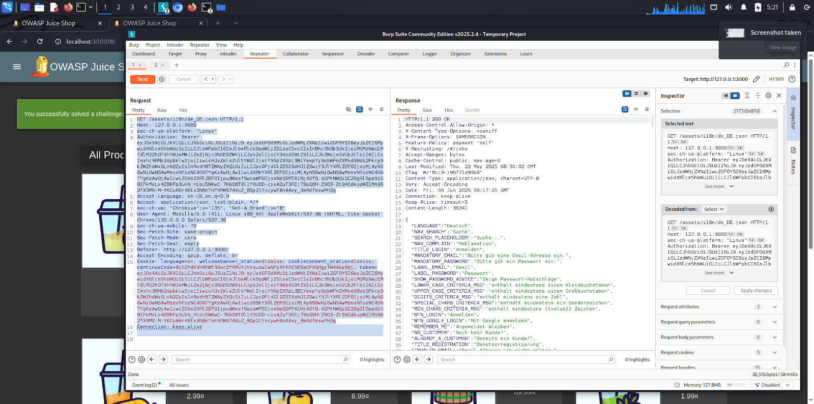
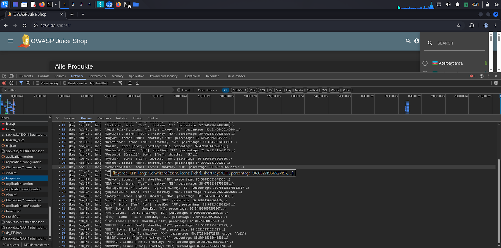
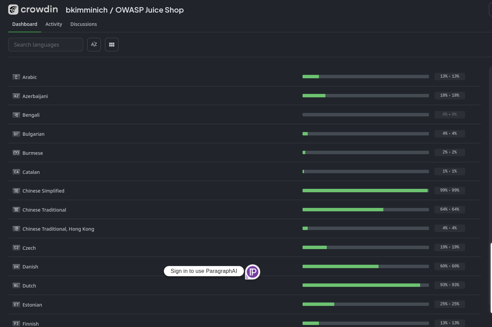
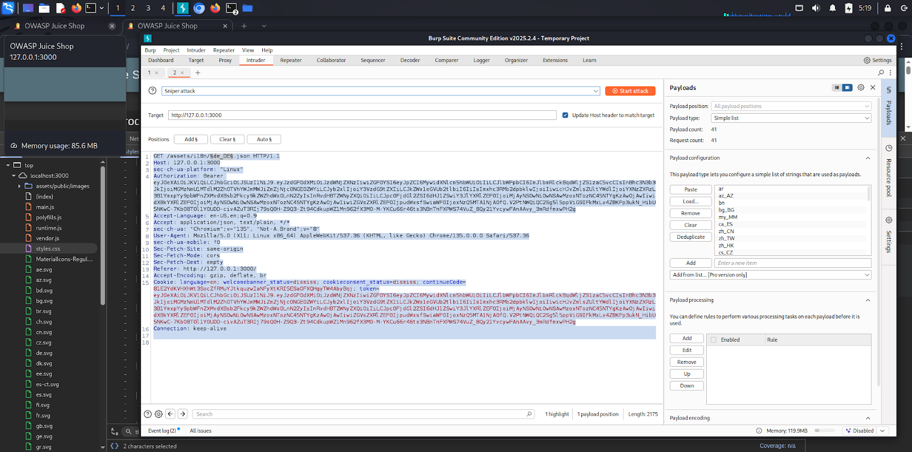
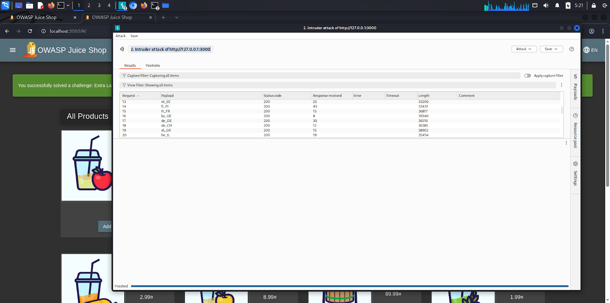
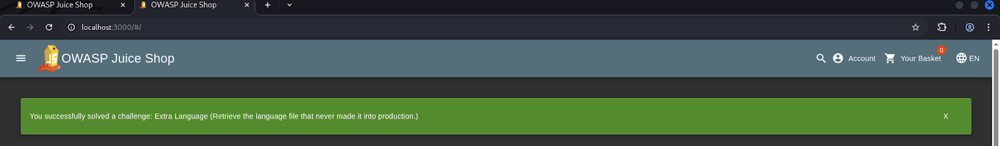

# Juice Shop Hacking Challenges – Extra Language

## Table of Contents

1. [Challenge Description](#challenge-description)  
2. [Solution Approach](#solution-approach)  
3. [Security Implications](#security-implications)  
4. [Video Demonstration](#video-demonstration)

---

## Challenge Description

**Challenge:** Extra Language  
**Difficulty:** ★★★★★ (5 stars)  
**Objective:** Retrieve the language file that never made it into production.

---

## Solution Approach

1.  **Initial Request Analysis (Burp Suite):** * Started Burp Suite and observed network traffic while interacting with the language selection feature in Juice Shop.
    * Identified GET requests for language files, such as `/assets/i18n/de_DE.json`. This revealed the file naming convention (`[language_code].json`) and the base path (`/assets/i18n/`).

    ```http
        GET /assets/i18n/de_DE.json HTTP/1.1
        Host: 127.0.0.1:3000
        ... (other request headers) ...
    ```

    

2.  **Developer Tools Exploration:** * My first approach was to inspect the browser's **Developer Tools** (specifically the "Sources" or "Network" tabs). I looked for any lists or patterns of flag images (`.svg` files) or related JSON files (`i18n` for internationalization) that might reveal existing language codes.
    * This allowed me to find some two-letter country codes (e.g., `de`, `us`, `gb`) and more specific language codes (e.g., `de_DE`, `ko_KR`), confirming the format used by the application for its language files.

    

3.  **Python Script for Brute-Forcing (Initial Idea):** * With the observed `[language_code].json` pattern, I considered a brute-force approach for short, generic codes. I wrote a Python script using `itertools` and `requests` to generate combinations of `charset` characters (alphanumeric) for lengths of 2 to 3 and request `assets/i18n/[guess].json`.

    ```python
    import itertools
    import requests

    # CONFIG
    charset = "abcdefghijklmnopqrstuvwxyzABCDEFGHIJKLMNOPQRSTUVWXYZ0123456789_"
    min_length = 2
    max_length = 2  # Initially kept short for testing
    base_url = "http://localhost:3000/assets/i18n/"
    extension = ".json"

    def generate_guesses(charset, min_len, max_len):
        for length in range(min_len, max_len + 1):
            for combo in itertools.product(charset, repeat=length):
                yield ''.join(combo)

    def main():
        for guess in generate_guesses(charset, min_length, max_length):
            url = f"{base_url}{guess}{extension}"
            try:
                res = requests.get(url, timeout=3)
                if res.status_code == 200:
                    print(f"✅ Found: {url}")
            except requests.RequestException as e:
                print(f"⚠️ Error accessing {url}: {e}")

    if __name__ == "__main__":
        main()
    ```
    * The  script returned a 200 OK status code for every generated country code, which means the server responded positively regardless of whether the language file actually existed. Because valid and invalid requests both yielded the same successful status, the brute force approach failed to distinguish hidden or extra language files from the standard ones. This lack of differentiation made it impossible to identify any unique or unexpected language files using this method.

4.  **Crowdin Project Discovery (Key Breakthrough):** * Realizing that a generic brute-force might not be efficient, I refined my search for "Juice Shop supported languages" which led to the official Juice Shop project on **Crowdin** (`https://crowdin.com/project/owasp-juice-shop`).
    * This platform, used for managing translations, provided a comprehensive and exact list of all languages and their corresponding keys that the Juice Shop application potentially supports, including those not yet fully translated or publicly exposed. This was the critical piece of information needed to identify the precise language codes.

    

5.  **Compiling a Target Language Code List:** Based on the detailed information from Crowdin, I compiled a comprehensive list of ISO 3166-1 alpha-2 country codes and other language keys used in the Juice Shop. This list included (but was not limited to) codes like `ar`, `az_AZ`, `bn`, `bg_BG`, `my_MM`, `ca_ES`, `zh_CN`, `zh_TW`, `zh_HK`, `cs_CZ`, `da_DK`, `nl_NL`, `et_EE`, `fi_FI`, `fr_FR`, `ka_GE`, `de_DE`, `de_CH`, `el_GR`, `he_IL`, `hi_IN`, `hu_HU`, `id_ID`, `ga_IE`, `it_IT`, `ja_JP`, `tlh_AA`, `ko_KR`, `lv_LV`, `no_NO`, `pl_PL`, `pt_PT`, `pt_BR`, `ro_RO`, `ru_RU`, `si_LK`, `es_ES`, `sv_SE`, `th_TH`, `tr_TR`, `uk_UA`.

6.  **Final Brute-Forcing with Burp Intruder:** * The initial `GET /assets/i18n/de_DE.json` request was sent to Burp Suite's **Intruder**.
    * The `de_DE` portion of the URL was set as the **payload position**.
    * The comprehensive list of language codes from Crowdin was loaded as a **Simple List** payload.
    * The Intruder attack was started to systematically request each `[language_code].json` file.

    

    During the attack, the script sent requests for numerous language files, and many of these requests received a 200 OK response, indicating that the files existed or the requests were accepted. However, despite the broad success in receiving valid responses, only the request for the tlh_AA.json file (representing the Klingon language) triggered a unique event—a “challenge solved” response. This specific response highlighted that while many language files were accessible, tlh_AA.json had special significance, likely due to it being a hidden or extra file linked to the challenge’s objective. The brute force approach of generating country or language codes didn’t help distinguish hidden files by status code alone, but the special reaction to tlh_AA.json identified it as the key target.
    
    

    ```http
    GET /assets/i18n/tlh_AA.json HTTP/1.1
    Host: 127.0.0.1:3000
    ... (other request headers) ...
    ```

    **Response for `tlh_AA.json`:**
    ```http
    HTTP/1.1 200 OK
    Access-Control-Allow-Origin: *
    X-Content-Type-Options: nosniff
    ... (other response headers) ...
    Content-Type: application/json; charset=UTF-8
    Content-Length: [size of Klingon JSON]

    {
      "LANGUAGE": "tlhIngan Hol",
      "NAV_SEARCH": "Qapta'",
      "SEARCH_PLACEHOLDER": "jaj...",
      ... (Klingon translations) ...
    }
    ```
    **Success : `tlh_AA.json`**

    


## Security Implications

-   **Information Disclosure:** This vulnerability demonstrates how an application can unintentionally expose sensitive or non-public files through predictable naming conventions (e.g., language codes, sequential IDs).
-   **Broken Anti-Automation/Weak Access Control:** The server allowed arbitrary requests to the `/assets/i18n/` directory without proper authorization or rate limiting, enabling a brute-force attack to discover hidden resources.
-   **Potential for Malicious Files:** While this challenge involved a harmless language file, similar vulnerabilities could allow attackers to discover and access other unintended files, potentially containing sensitive data, configuration details, or even executable code.

---

## Video Demonstration

A detailed walkthrough of this challenge, including discovery, exploitation, and explanation, is available in the Loom video:  
**[[Loom Video Link](https://www.loom.com/share/6172a8d42ba544f38c6aa0541444f85c?sid=ee9c93c7-c87e-43ea-af6f-7ee1e6c4fc09)]** 

